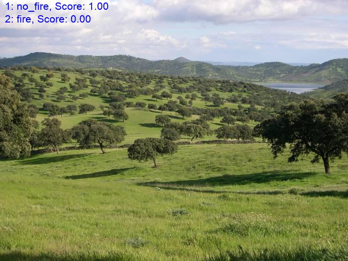

### Introduction
This project is jointly done in colaboration with [Anuj Regmi](https://www.linkedin.com/in/regmianuj1/), for detecting whether there is fire or not in the forest while monitoring from unmanned aerial vehicles (UAVs). This project can be modified for classification of any number of classes in various fields of study from agriculture to defense.

### Usuage
1. For downloading the images from online [here Google and Bing], run `online-download-data.py`
2. There is pre-trained model trained for 24 epochs for detecting fire in the forest - `fire-detection-inference.py`

### Results

### Reference:
1. [Image Classification using Transfer Learning in PyTorch](https://www.learnopencv.com/image-classification-using-transfer-learning-in-pytorch/)
2. [Sczhengyabin Image-Downloader](https://github.com/sczhengyabin/Image-Downloader) 
